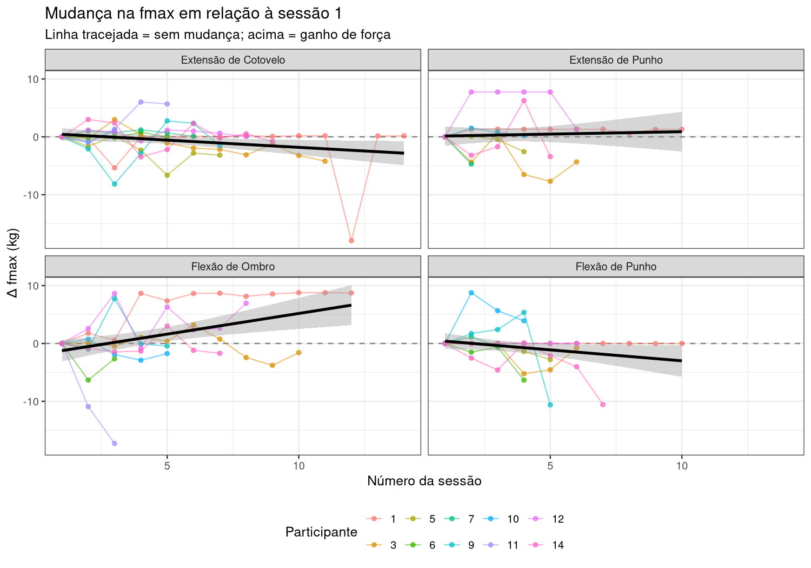
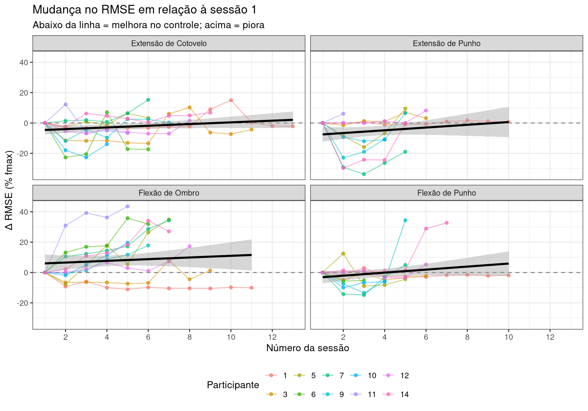
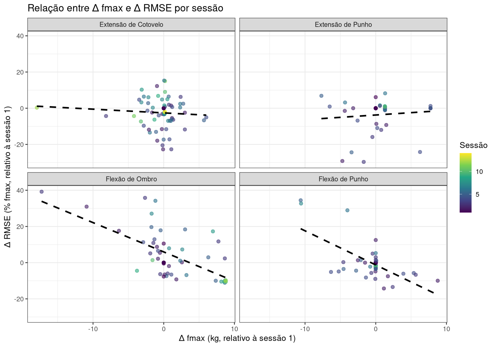
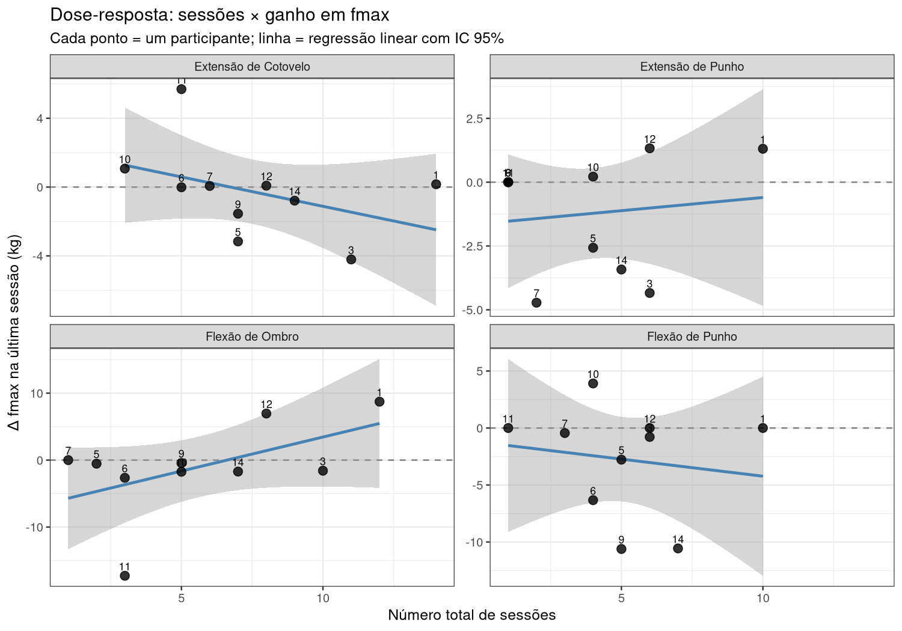
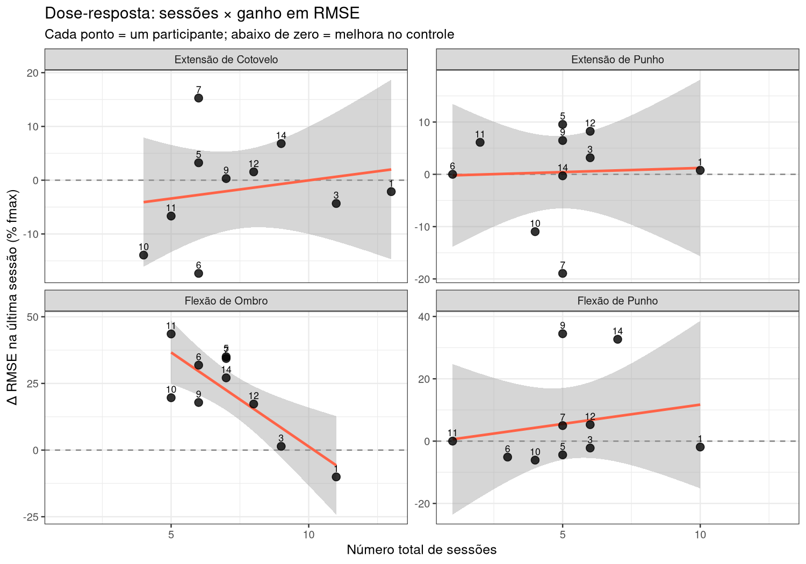

# Análise dos Dados

## Participantes e Protocolo

Dez participantes com histórico de acidente vascular cerebral (IDs: 1, 3, 5, 6, 7, 9, 10, 11, 12, 14) foram acompanhados ao longo de aproximadamente quatro meses, entre setembro e dezembro de 2025, com frequência de duas sessões semanais. Em cada sessão foram avaliados quatro movimentos isométricos: extensão de cotovelo, extensão de punho, flexão de ombro e flexão de punho. A sessão era composta por dois momentos distintos. No primeiro, o participante realizava um teste de força máxima voluntária (fmax), sustentando a contração máxima por cerca de 10 segundos. No segundo, realizava entre 6 e 15 tentativas de controle de força, nas quais deveria manter a força em um percentual-alvo da fmax própria — tipicamente 30%, 40% ou 70% —, orientado por uma referência visual em tempo real.

## Processamento dos Sinais de Força Máxima

Os dados foram registrados em arquivos TSV sem cabeçalho, com decimal representado por vírgula, a uma frequência de amostragem de 200 Hz. A escala do equipamento cobria de 0 a 1024 unidades ADC, correspondendo a uma faixa de 0 a 20 kg, com fator de conversão de 0,0195 kg por unidade. O primeiro registro de cada arquivo apresentava sistematicamente um valor espúrio de inicialização do hardware, sendo descartado antes de qualquer processamento. O sinal de força bruta foi suavizado por uma média deslizante de 200 ms (40 amostras a 200 Hz), eliminando picos instantâneos de ruído e permitindo identificar o pico de força sustentada — definido como o máximo do sinal suavizado. Arquivos em que esse pico era inferior a 80 unidades ADC foram descartados, por corresponderem a registros onde o participante não realizou contração efetiva. Esse limiar foi determinado empiricamente a partir da distribuição dos picos em todos os 298 arquivos de fmax, que revelou uma lacuna natural entre valores de ruído, com máximo de até 47 ADC, e contrações reais, com mínimo de 81 ADC. Quando havia mais de uma tentativa de fmax em uma mesma sessão, foi retida aquela com o maior pico suavizado. Arquivos com um prefixo específico nos nomes indicavam avaliações do membro contralateral ou condições preliminares, com força tipicamente cinco vezes menor, e foram excluídos da análise. Após esses procedimentos, foram obtidas 222 combinações participante × movimento × sessão com fmax válida.

## Processamento das Tentativas de Controle de Força

Para o cálculo do erro de rastreamento, o sinal de cada tentativa foi submetido a um processo de limpeza antes da extração das métricas. O trecho final de alguns registros apresentava um plateau congelado, onde a força bruta deixava de variar entre amostras consecutivas, indicando que a gravação continuou após o encerramento voluntário da contração. Esse trecho foi identificado e removido automaticamente. Em seguida, os primeiros e últimos 1,0 segundo de cada tentativa foram descartados, eliminando as rampas de início e estabilização da força. O valor de 1,0 s foi adotado após constatar que o corte de 0,5 s era insuficiente para excluir o transiente inicial. Tentativas foram mantidas independentemente de quanto a força produzida se afastou da meta, pois uma análise de sensibilidade mostrou que excluir tentativas com produção muito acima ou abaixo do alvo não alterava os resultados em nível de sessão — o RMSE de sessão é uma média de várias tentativas e a influência de tentativas individuais extremas é diluída. Sessões sem fmax válida registrada foram mantidas na análise do RMSE, pois o erro de rastreamento é expresso nos percentuais gravados no próprio arquivo de tentativa, independentemente de uma medida de fmax da mesma sessão.

O erro de rastreamento de cada tentativa foi quantificado pela raiz do erro quadrático médio (RMSE) entre a força-alvo e a força produzida, ambas em percentual da fmax. O RMSE da sessão foi definido como a média aritmética dos RMSEs de todas as tentativas válidas. Foram obtidas 247 combinações participante × movimento × sessão com RMSE calculado.

Nenhum filtro passa-baixa adicional foi aplicado ao sinal de força das tentativas. Essa decisão foi baseada em análise espectral de 12 arquivos representativos, distribuídos entre participantes e movimentos. A densidade espectral de potência não revelou picos em 50 Hz (razão em relação ao piso espectral: 1,5×) nem em 60 Hz (0,5×) — valores compatíveis com ausência de contaminação por ruído de rede elétrica, para os quais razões de 10× ou mais seriam esperadas. A energia acima de 20 Hz, presente em alguns registros (até 13,5% da energia total), exibiu perfil de banda larga sem concentração em frequências específicas, padrão consistente com tremor fisiológico. Como o tremor é uma manifestação real do déficit motor em pacientes pós-AVC e representa parte do erro de controle que o RMSE pretende capturar, sua remoção por filtragem seria metodologicamente inadequada.

## Normalização pela Linha de Base e Análise Estatística

Para remover a heterogeneidade de baseline entre participantes — que apresentavam forças máximas muito distintas entre si —, ambas as variáveis foram expressas como diferença em relação ao valor da primeira sessão de cada participante em cada movimento, resultando em Δfmax (kg) e ΔRMSE (% fmax). Por construção, esses deltas são zero na sessão 1, que foi excluída dos modelos estatísticos.

A tendência temporal foi estimada por modelos lineares mistos, ajustados separadamente para cada movimento, com o número de sessão como preditor fixo e efeitos aleatórios de intercepto e inclinação por participante, permitindo trajetórias individuais distintas. Quando o modelo com slope aleatório resultava em ajuste singular, utilizou-se apenas intercepto aleatório. A relação entre Δfmax e ΔRMSE foi quantificada pela correlação de Pearson por movimento, com intervalo de confiança de 95% obtido pela transformação de Fisher.

Para investigar uma relação dose-resposta entre exposição ao protocolo e desfechos, calculou-se, por participante e movimento, o total de sessões frequentadas e o valor de Δfmax e ΔRMSE registrado na última sessão disponível — representando a mudança acumulada do início ao fim da participação. A associação entre o número total de sessões e esses deltas finais foi estimada pela correlação de Pearson, também com IC 95% pela transformação de Fisher. Esse nível de análise é entre participantes, complementando os modelos intraindividuais descritos acima.

---

# Resultados

## Força Máxima

A Figura 1 apresenta as trajetórias individuais e a tendência populacional do Δfmax ao longo das sessões. O valor zero corresponde à força máxima da primeira sessão de cada participante; valores positivos indicam ganho de força e valores negativos indicam redução em relação à linha de base.

Os modelos mistos indicaram tendência de redução da força máxima ao longo das sessões em todos os movimentos avaliados (Tabela 1). A extensão de cotovelo apresentou queda significativa de aproximadamente 0,29 kg por sessão (β = −0,285; EP = 0,131; p = 0,034). A flexão de punho mostrou tendência marginal de redução de 0,98 kg por sessão (β = −0,977; EP = 0,396; p = 0,057), com intervalo de confiança que excluía o zero. Para extensão de punho e flexão de ombro, as tendências não alcançaram significância estatística, com ampla incerteza nas estimativas dada a maior variabilidade entre participantes nesses movimentos.

**Tabela 1.** Resultados do modelo linear misto para Δfmax (kg) em função do número de sessão. β representa a mudança média estimada em kg por sessão adicional (EP = erro padrão; IC 95% = intervalo de confiança).

| Movimento            | β (kg/sessão) |   EP  |   t   |    p    | IC 95%            |
|----------------------|:-------------:|:-----:|:-----:|:-------:|-------------------|
| Extensão de cotovelo |    −0,285     | 0,131 | −2,17 | **0,034** | [−0,543; −0,028] |
| Extensão de punho    |    −0,134     | 0,243 | −0,55 |   0,586   | [−0,609; +0,342] |
| Flexão de ombro      |    −0,312     | 0,321 | −0,97 |   0,410   | [−0,940; +0,317] |
| Flexão de punho      |    −0,977     | 0,396 | −2,47 |   0,057   | [−1,750; −0,201] |

## Erro de Rastreamento

A Figura 2 apresenta as trajetórias individuais e a tendência do ΔRMSE ao longo das sessões. Valores abaixo de zero indicam melhora no controle em relação à primeira sessão; valores acima de zero indicam piora.

Os modelos mistos indicaram tendência de aumento do erro de rastreamento ao longo das sessões em todos os movimentos (Tabela 2). Três dos quatro movimentos apresentaram aumento significativo do RMSE ao longo das sessões. Flexão de ombro mostrou o maior coeficiente, com aumento de aproximadamente 4,1 pontos percentuais de fmax por sessão (β = +4,127; EP = 0,802; p < 0,001). Extensão de punho, que em análises anteriores apresentava tendência marginal, tornou-se significativa com a inclusão das sessões sem fmax, com aumento de 3,5 pontos percentuais por sessão (β = +3,517; EP = 1,178; p = 0,018). Extensão de cotovelo manteve tendência significativa de menor magnitude (β = +0,953; EP = 0,322; p = 0,006). Flexão de punho apresentou tendência positiva, porém não significativa (β = +3,228; EP = 1,700; p = 0,093).

**Tabela 2.** Resultados do modelo linear misto para ΔRMSE (% fmax) em função do número de sessão. β representa a mudança média estimada em pontos percentuais de RMSE por sessão adicional.

| Movimento            | β (%/sessão) |   EP  |   t   |    p    | IC 95%           |
|----------------------|:------------:|:-----:|:-----:|:-------:|------------------|
| Extensão de cotovelo |   +0,953     | 0,322 | +2,96 | **0,006** | [+0,322; +1,584] |
| Extensão de punho    |   +3,517     | 1,178 | +2,98 | **0,018** | [+1,208; +5,826] |
| Flexão de ombro      |   +4,127     | 0,802 | +5,14 | **< 0,001** | [+2,555; +5,699] |
| Flexão de punho      |   +3,228     | 1,700 | +1,90 |   0,093   | [−0,104; +6,560] |

## Relação entre Força Máxima e Erro de Rastreamento

A Figura 3 apresenta o diagrama de dispersão entre Δfmax e ΔRMSE por sessão, para cada movimento.

A análise de correlação, calculada apenas para sessões com fmax válida (nas quais o Δfmax pode ser determinado), revelou padrões distintos entre os grupos de movimentos (Tabela 3). Para os movimentos de flexão, a associação entre Δfmax e ΔRMSE foi negativa, forte e altamente significativa: sessões em que o participante apresentou maior força em relação à sua linha de base também tenderam a apresentar menor erro de rastreamento, com coeficientes de −0,624 para flexão de ombro e −0,654 para flexão de punho (p < 0,001 em ambos). Para os movimentos de extensão, a correlação foi próxima de zero e não significativa (r = −0,075 e r = +0,100, respectivamente; p > 0,5), sugerindo que força e controle variam de forma independente nesses movimentos.

**Tabela 3.** Correlação de Pearson (r) entre Δfmax e ΔRMSE por movimento, com intervalo de confiança de 95% pela transformação de Fisher.

| Movimento            |  n  |    r    |      p      | IC 95%           |
|----------------------|:---:|:-------:|:-----------:|------------------|
| Extensão de cotovelo |  73 | −0,075  |    0,526    | [−0,300; +0,157] |
| Extensão de punho    |  39 | +0,100  |    0,546    | [−0,223; +0,402] |
| Flexão de ombro      |  53 | **−0,624** | **< 0,001** | [−0,765; −0,425] |
| Flexão de punho      |  50 | **−0,654** | **< 0,001** | [−0,789; −0,459] |

Esses achados evidenciam um padrão aparentemente paradoxal: enquanto os modelos longitudinais indicam aumento do erro e redução da força ao longo do tempo, a correlação por sessão revela que maior força está associada a melhor controle. Esse contraste sugere que a relação biológica entre capacidade de força e precisão no controle motor é real e clinicamente relevante, mas que outros fatores — possivelmente relacionados à progressão da condição neurológica, à fadiga acumulada ao longo do protocolo ou à heterogeneidade na participação entre os indivíduos — impõem uma tendência de deterioração em ambas as variáveis ao longo das semanas de avaliação.

## Dose-Resposta: Quantidade de Sessões e Desfecho Final

A Figura 4 e a Figura 5 apresentam, para cada participante e movimento, a relação entre o número total de sessões frequentadas e a mudança acumulada em fmax e RMSE (da primeira à última sessão).

Para a força máxima, nenhum movimento apresentou correlação significativa entre o número de sessões e o ganho ou perda de fmax ao final do protocolo (Tabela 4). Os coeficientes variaram de −0,41 a +0,53, todos com p > 0,10, indicando que a quantidade de sessões frequentadas não prediz o desfecho final de força máxima.

**Tabela 4.** Correlação de Pearson entre o número total de sessões e o Δfmax na última sessão, por movimento.

| Movimento            |  n  |    r    |    p    | IC 95%           |
|----------------------|:---:|:-------:|:-------:|------------------|
| Extensão de cotovelo |  10 | −0,412  |  0,237  | [−0,827; +0,294] |
| Extensão de punho    |  10 | +0,130  |  0,721  | [−0,544; +0,702] |
| Flexão de ombro      |  10 | +0,529  |  0,116  | [−0,150; +0,869] |
| Flexão de punho      |  10 | −0,150  |  0,680  | [−0,712; +0,530] |

Para o erro de rastreamento, o padrão foi distinto: a flexão de ombro apresentou correlação negativa forte e significativa entre número de sessões e ΔRMSE final (r = −0,80; p = 0,005; IC 95%: [−0,951; −0,343]), indicando que participantes que frequentaram mais sessões apresentaram maior melhora no controle motor desse movimento ao final do protocolo (Tabela 5). Para os demais movimentos, as correlações foram próximas de zero e não significativas.

**Tabela 5.** Correlação de Pearson entre o número total de sessões e o ΔRMSE na última sessão, por movimento.

| Movimento            |  n  |    r    |      p      | IC 95%           |
|----------------------|:---:|:-------:|:-----------:|------------------|
| Extensão de cotovelo |  10 | +0,197  |    0,585    | [−0,494; +0,736] |
| Extensão de punho    |  10 | +0,043  |    0,907    | [−0,603; +0,655] |
| Flexão de ombro      |  10 | **−0,800** | **0,005** | [−0,951; −0,343] |
| Flexão de punho      |  10 | +0,195  |    0,589    | [−0,495; +0,735] |

O resultado para flexão de ombro é notável por contrastar com a tendência longitudinal de piora do RMSE descrita anteriormente: embora o grupo como um todo tenha apresentado aumento do erro ao longo das sessões, participantes com maior exposição ao protocolo acumularam desfechos finais relativamente melhores. Isso sugere que a frequência de participação pode modular o efeito do protocolo sobre o controle motor do ombro, ainda que esse efeito não se generalize aos demais movimentos.
